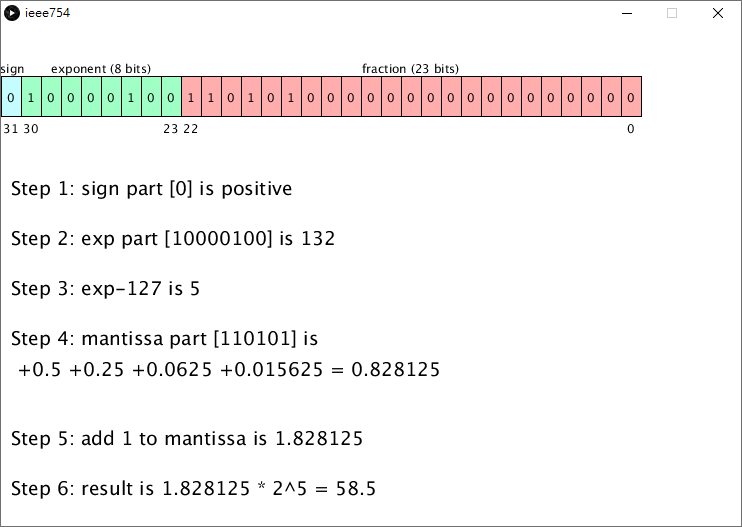

# IEEE 754 Vis
為了回覆網友的問題, 我寫了這個專案, 可以將 IEEE 754 Visualization 視覺化呈現。

作者: 葉正聖 jsyeh@mail.mcu.edu.tw

## p5.js 範例

[IEEE 754 用滑鼠互動](https://jsyeh.org/ieee754/ieee754JS/)
(可用 mouse 點擊 bits 學習 IEEE 754)

## Processing 範例


```processing
//有網友遇到 IEEE 754 計算的問題, 所以我想把它畫出來, 方便理解
//參考資料 https://en.wikipedia.org/wiki/IEEE_754
//可以產生最大值、最小值。秀出2個float的加減乘除等
//float (32-bit), double (64-bit)
//Value = sign * exp * fraction
//float f = 0.15625; //Wikipedia用這個範例
float f = 58.5;//網友用這個範例 https://www.youtube.com/watch?v=RuKkePyo9zk&t=1165s
int []bit=new int[32];//小心前後位數的不同
void setup() {
  size(740, 500);
  //https://stackoverflow.com/questions/10643754/convert-float-to-bits
  int N = Float.floatToIntBits(f);//LSB
  for (int i=0; i<32; i++) {
    bit[i] = (N>>i) & 0x01;
  }
}
void draw() {
  background(255);
  textAlign(CENTER, CENTER);
  textSize(12);
  for (int i=0; i<32; i++) {
    if (i<1) fill(197, 252, 255);
    else if (i<9) fill(160, 255, 197);
    else fill(255, 173, 173);
    rect(i*20, 50, 20, 40);
    fill(0); 
    text(bit[31-i], i*20+20/2, 50+40/2 );
    //LSB: Least Significant Bit, LSB 最小位在最右邊,又 x86 是 Little Endian
  }
  textAlign(CENTER, BOTTOM);  
  fill(0); 
  text("sign", (1+0)*20/2, 50);
  text("exponent (8 bits)", (9+1)*20/2, 50);
  text("fraction (23 bits)", (32+9)*20/2, 50);
  text("31", (1+0)*20/2, 50+40+20);
  text("30", (2+1)*20/2, 50+40+20);
  text("23", (9+8)*20/2, 50+40+20);
  text("22", (10+9)*20/2, 50+40+20);
  text("0", (32+31)*20/2, 50+40+20);

  textAlign(LEFT, TOP);
  textSize(19);
  text("Step 1: sign part ["+bit[31]+"] is " + ((bit[31]==0)?"positive":"negtive"), 10, 150);
  int step2 = bitInt(30,23);
  text("Step 2: exp part [" +bitString(30,23) + "] is " + step2, 10, 200);
  int step3 = step2 - 127;
  text("Step 3: exp-127 is " + step3, 10,250);
  int last=0;
  for(int i=31; i>=0; i--){
    if(bit[i]==1) last=i;
  }
  text("Step 4: mantissa part [" + bitString(22,last) + "] is \n" + mentissaString(last), 10, 300, width-10,200);
  float step5=(mentissa+1);
  text("Step 5: add 1 to mantissa is " + step5, 10, 400);
  text("Step 6: result is " +  step5 + " * 2^"+(bitInt(30,23)-127) + " = " + (step5*pow(2,step3)), 10, 450);
  if( mousePressed && (mouseY<50 || mouseY>90) ){//提示可以按中間
    fill(128,128); rect(0,0,width,50);
    fill(128,128); rect(0,90, width,height-90);
  }

}
String bitString(int a, int b){
  String ans = "";
  for(int i=a; i>=b; i--) ans+= bit[i];
  return ans;
}
int bitInt(int a, int b){
  int ans = 0;
  for(int i=a; i>=b; i--){
    ans *=2;
    ans += bit[i];
  }
  return ans;
}
float mentissa=0;
float mentissaHeight=0;
String mentissaString(int last){
  String ans = "";
  float _mentissa = 0, div = 1;
  for(int i=22; i>=last; i--){
    div /= 2;
    if(bit[i]==1){
      ans += " +" + div;
      _mentissa += div;
    }
  }
  ans += " = " + _mentissa;
  mentissa = _mentissa;
  return ans;
}
void mousePressed(){
  if(mouseY>50 && mouseY<90){
    int i = mouseX/20;
    if(i>31 || i<0) return;
    bit[31-i] = 1 - bit[31-i];
  }
}
```
